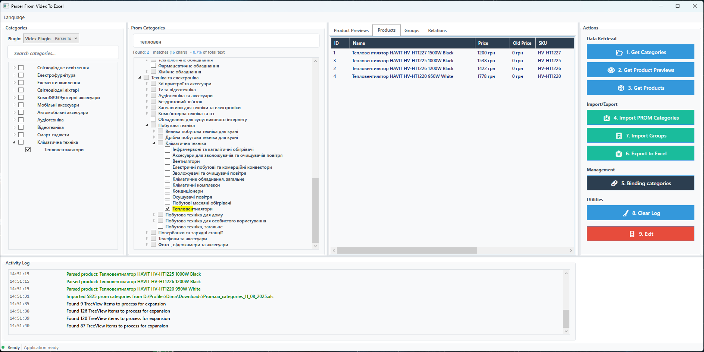
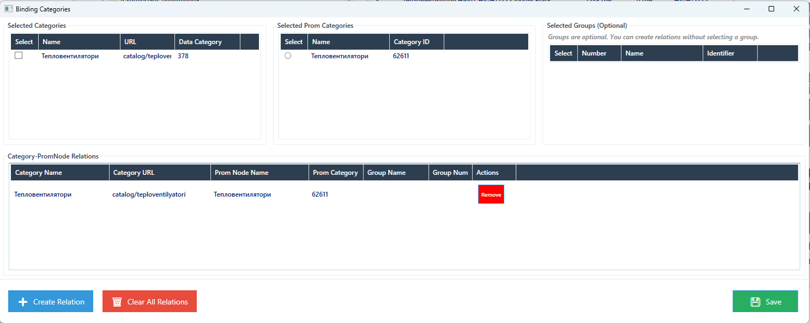

# Парсер для товарів на PROM

WPF-застосунок, призначений для отримання даних про товари з різних джерел та експорту їх на PROM у формат Excel. Застосунок має модульну архітектуру, що дозволяє легко додавати підтримку нових джерел даних.

## Можливості

- **Модульна архітектура**: Легке розширення за допомогою власних плагінів для різних джерел даних
- **Багатомовна підтримка**: Вбудована підтримка кількох мов (наприклад, англійська, українська)
- **Сучасний інтерфейс**: Чіткий, адаптивний інтерфейс WPF у сучасному стилі
- **Експорт даних**: Експорт оброблених даних у формат Excel (XLSX)
- **Пошук та фільтрація**: Розширені можливості пошуку та фільтрації категорій і товарів
- **Система логування**: Вбудована система логування з різними рівнями деталізації

## Скріншоти

<p align="center">
  
  <p align="center">Головне вікно програми</p>
</p>

<p align="center">
  
  <p align="center">Вікно для створення зв`язків між категоріями товарів, PROM-категоріями та власних категорій</p>
</p>

## Вимоги

- .NET 9.0 або новішої версії
- Windows 10/11
- Visual Studio 2022 (для розробки)

## Встановлення

1. Клонуйте репозиторій:
   ```bash
   git clone https://github.com/Kds2k2/Parser_FromVidexToExcel.git
   ```
2. Відкрийте рішення у Visual Studio 2022
3. Зберіть рішення (Ctrl+Shift+B)
4. Запустіть додаток (F5)

## Використання

1. Виберіть джерело даних з доступних плагінів
2. Переглядайте або шукайте категорії товарів
3. Виберіть товари для експорту
4. Оберіть опції експорту та місце збереження
5. Натисніть "Експортувати в Excel" для створення вихідного файлу

## Розробка плагінів

Щоб створити новий плагін:

1. Створіть новий клас
3. Реалізуйте інтерфейс `IPlugin`

Приклад реалізації плагіна:

```csharp
public class MyPlugin : IPlugin
{
    public string BaseUrl => "https://example.com";
    public string CategoriesUrl => $"{BaseUrl}/categories";
    public string PluginName => "Мій власний плагін";
    
    public async Task<List<ProductPreview>> GetProductPreviews(string url)
    {
        // Реалізація тут
    }
    
    // Інші методи інтерфейсу...
}
```

## Залежності

- [ClosedXML](https://github.com/ClosedXML/ClosedXML) - Для створення файлів Excel
- [HtmlAgilityPack](https://html-agility-pack.net/) - Для аналізу HTML
- [NPOI](https://github.com/nissl-lab/npoi) - Для роботи з файлами Excel

## Локалізація

Додаток підтримує кілька мов за допомогою файлів ресурсів. Щоб додати нову мову:

1. Створіть новий файл ресурсів (наприклад, `StringResources.fr.xaml`)
2. Додайте переклади для всіх рядків
3. Оновіть вибір мови в налаштуваннях програми
