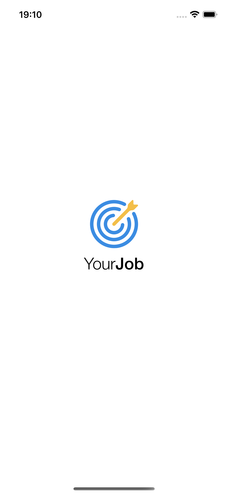
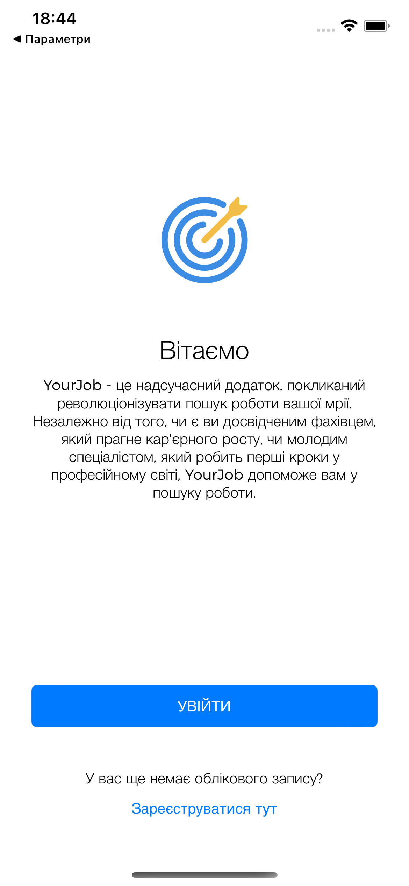
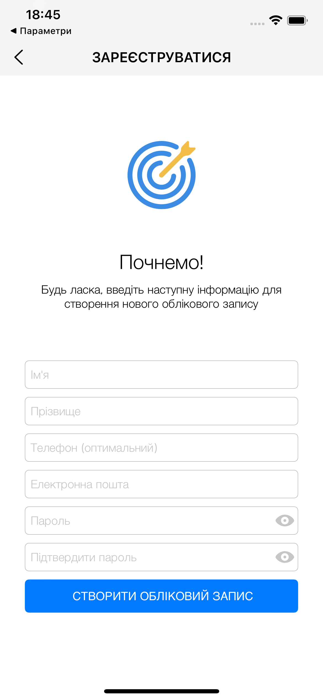
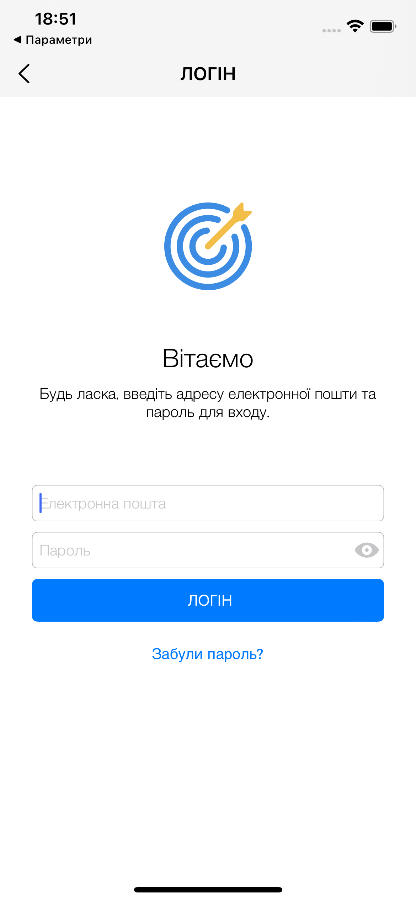
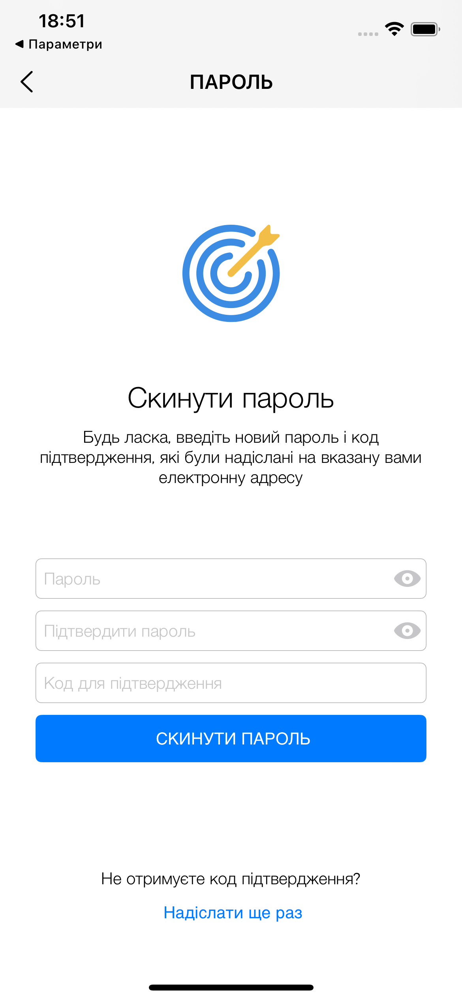
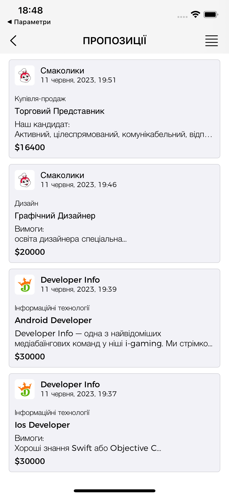
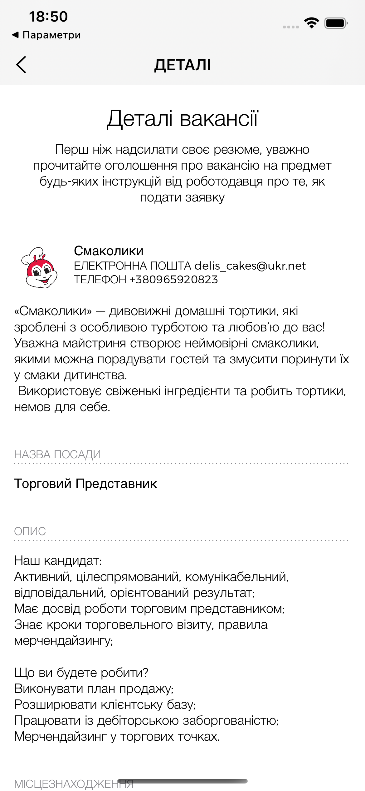
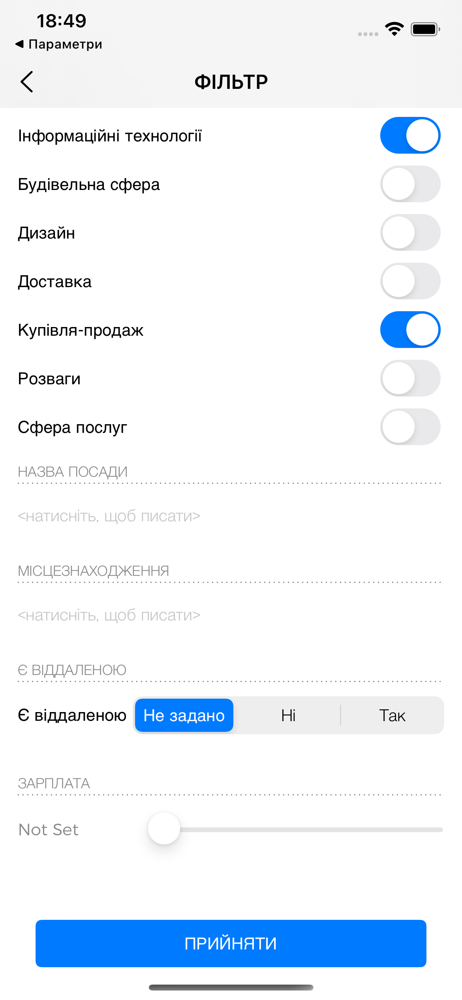

## YourJob — мобільний застосунок для пошуку роботи (iOS)

YourJob — навчальний проєкт мобільного застосунку, що допомагає швидко знаходити вакансії за заданими критеріями. Додаток реалізовано для iOS з акцентом на сучасну архітектуру, хмарні сервіси AWS та зручний інтерфейс.

### Основні можливості

- **Реєстрація та авторизація** через Amazon Cognito
- **Пошук і фільтрація вакансій** за категоріями, назвою посади, локацією, віддаленістю та зарплатою
- **Перегляд деталей вакансії** і інформації про роботодавця
- **Збереження фільтра пошуку** між сеансами
- **Темна/світла тема** та адаптивні інтерфейси для iPhone/iPad

### Скриншоти

Інтерфейс застосунку (натисніть, щоб переглянути у репозиторії):

<p align="center">
  
  
  
  
</p>
<p align="center">
  
  
  
  
</p>
<p align="center">
  
  
  
  
</p>

### Архітектура та дизайн

- **Клієнтська частина (iOS, Swift)**: патерн MVC, адаптивні UI, підтримка тем.
- **Бекенд (Serverless на AWS)**: GraphQL API через **AWS AppSync**, дані в **Amazon DynamoDB**.
- **Аутентифікація**: **Amazon Cognito (User Pool)**.
- **Аналітика та стабільність**: **Firebase Analytics**, **Firebase Crashlytics**.
- **Кешування та офлайн-доступ (частково)**: локальний кеш AWS AppSync + власні кеші зображень.

Сценарії доступу до даних:

- AppSync ⇄ DynamoDB (GraphQL: query/mutation/subscription)
- Cognito забезпечує авторизацію користувачів та підписування запитів

### Технологічний стек

- iOS 15+, Swift, Xcode, UIKit
- CocoaPods: `AWSAppSync`, `AWSCognitoIdentityProvider`, `Firebase/Analytics`, `Firebase/Crashlytics`
- AWS: Cognito, AppSync (GraphQL), DynamoDB, CloudWatch
- Допоміжні інструменти: Node.js, AWS CLI, Amplify CLI

### Встановлення та запуск (локально)

1. Вимоги:

   - Xcode 14+ (iOS 15+)
   - CocoaPods встановлено (`sudo gem install cocoapods`)
   - Node.js 18+, AWS CLI, Amplify CLI (`npm i -g @aws-amplify/cli`)

2. Залежності iOS:

   - Відкрийте термінал у корені проєкту та виконайте:
     ```bash
     pod install --repo-update
     ```
   - Відкрийте робочий файл `YourJob.xcworkspace` у Xcode.

3. Налаштування AWS (скорочено):

   - Створіть Cognito User Pool (Sign-in: Username або Email; дозволити самостійну реєстрацію; верифікація email).
   - Створіть DynamoDB таблиці: `YourJobEmployers`, `YourJobVacancies` з Partition key `id`.
   - Створіть AppSync GraphQL API, підключивши джерела даних до таблиць DynamoDB. Додайте схему з типами `YourJobEmployer`, `YourJobVacancy`, переліком категорій та операціями `Query/Mutation`.
   - Імпортуйте конфіг до застосунку за допомогою Amplify CLI:
     ```bash
     amplify init
     amplify import auth
     amplify add codegen --appId <your-app-id>
     amplify push
     ```
   - Переконайтеся, що згенерований `awsconfiguration.json` присутній у проєкті та налаштування AppSync/Cognito валідні.

4. Запуск:
   - Зберіть і запустіть застосунок у Xcode на симуляторі або пристрої.

### Структура клієнтського проєкту (iOS)

- `Api/` — GraphQL типи/операції та моделі
- `Components/` — багаторазові UI-компоненти
- `Controllers/` — екрани: Welcome, Sign Up, Login, Reset Password, Offers, Details, Filter
- `Extensions/` — розширення та утиліти
- `Resources/` — кольори, шрифти, зображення
- `AmplifyConfig/`, `GoogleService/` — конфігурації сервісів
- `AppDelegate.swift`, `AppInfo.swift` тощо — точка входу та службові класи

Ключові екрани:

- `WelcomeViewController` — вітальний екран і перевірка сесії
- `SignUpRegisterViewController`, `SignUpCompleteViewController` — реєстрація і підтвердження email
- `LoginWithEmailViewController`, `ResetPasswordViewController` — авторизація і відновлення паролю
- `VacancyOffersViewController` — список вакансій, Pull-to-Refresh, пагінація/підвантаження
- `VacancyFilterViewController` — налаштування фільтрів (категорії, назва, локація, віддалено, зарплата)
- `VacancyDetailsViewController` — деталі вакансії та інформація про роботодавця
