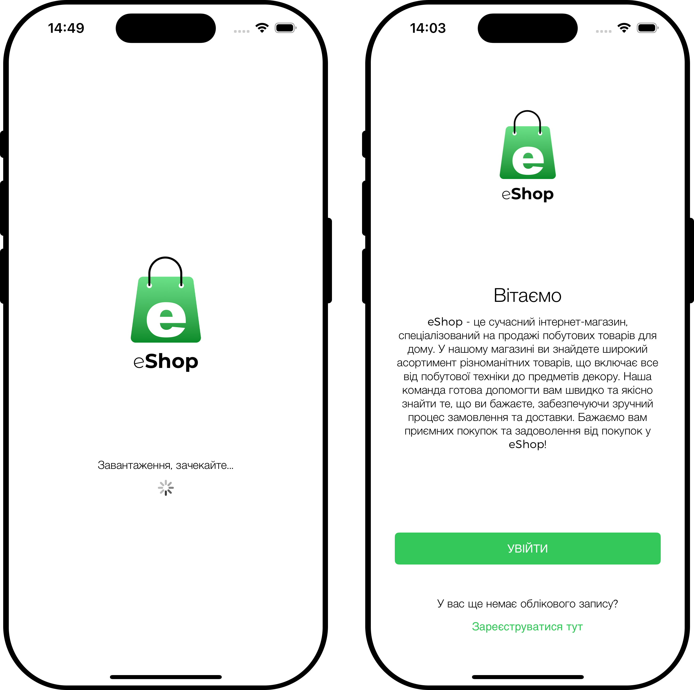
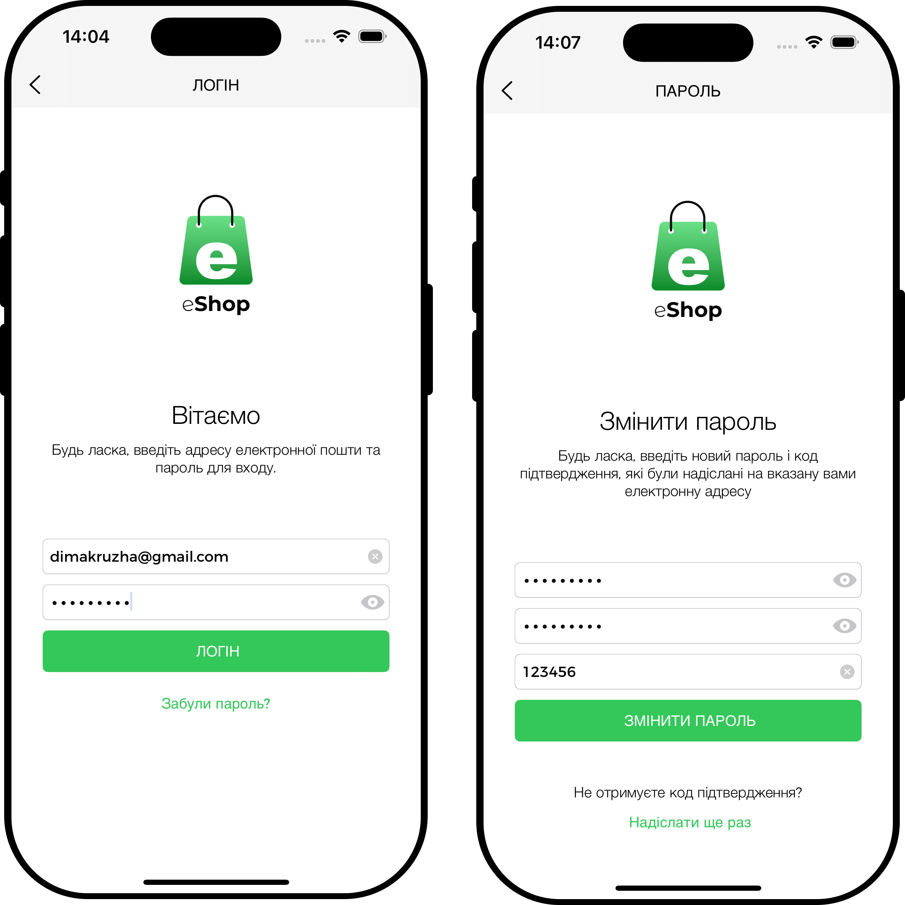
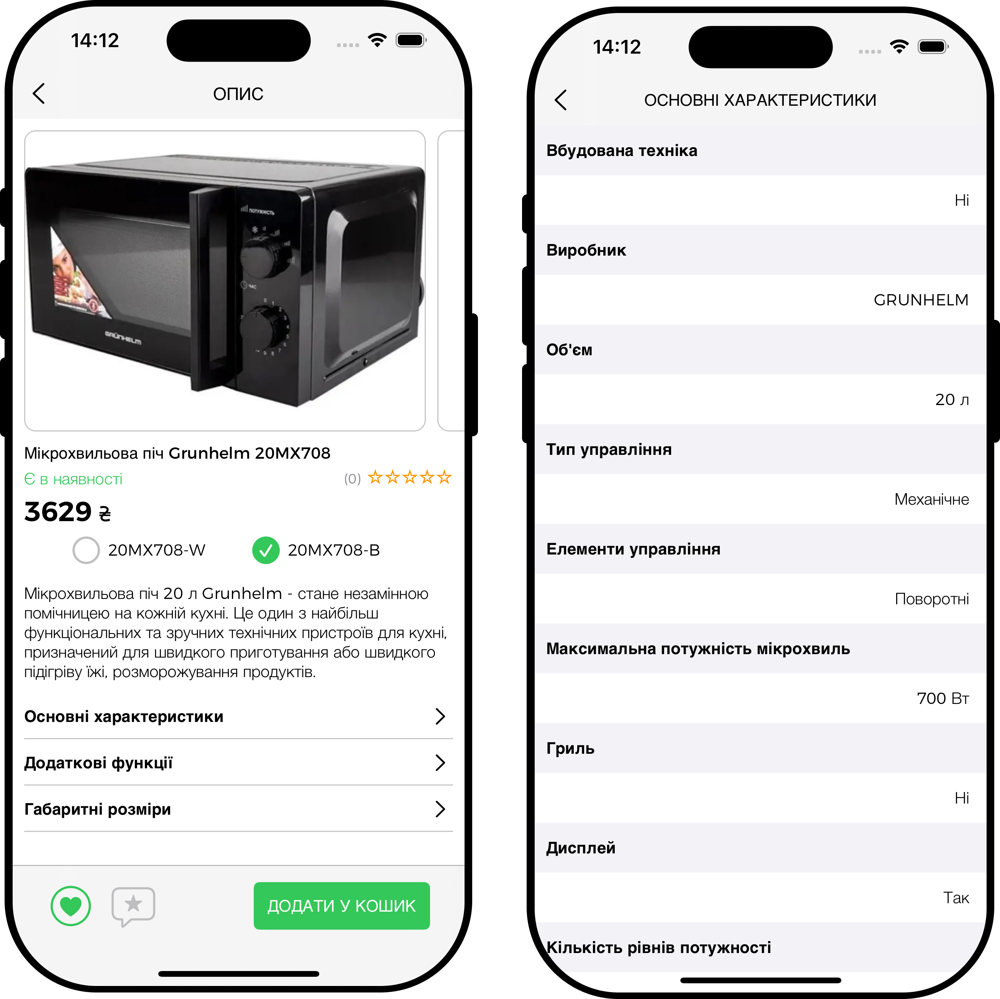
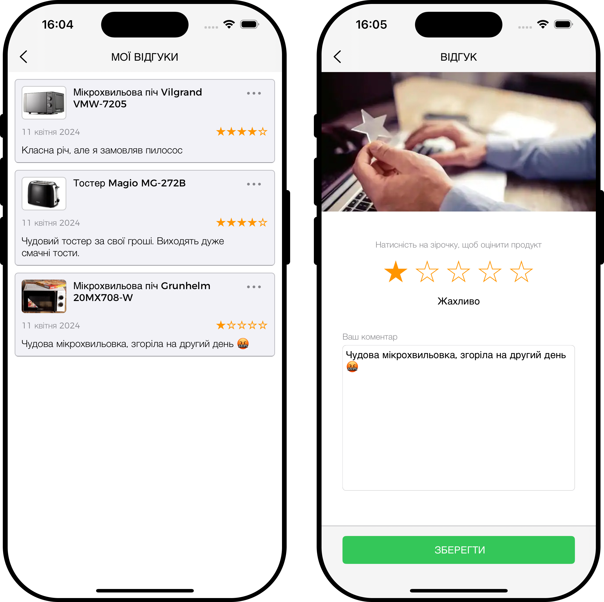
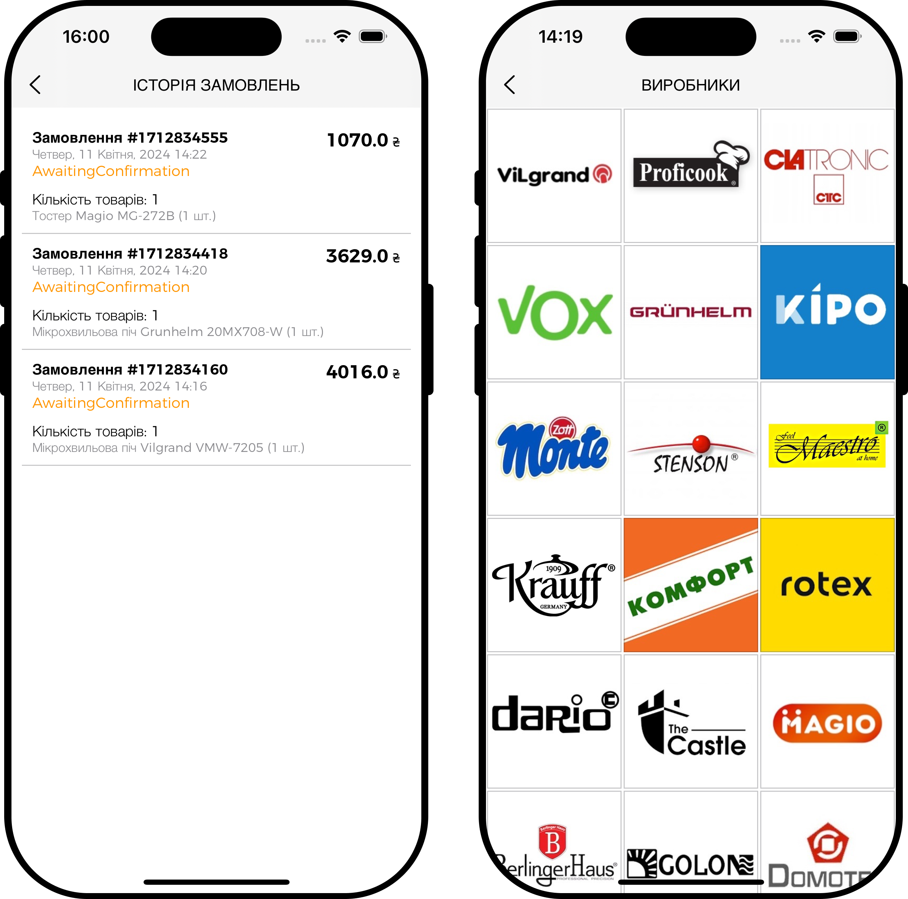
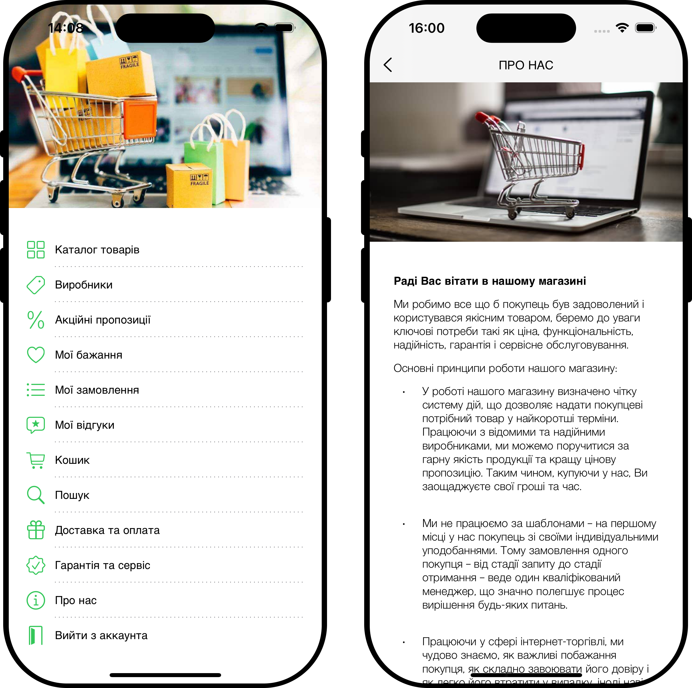
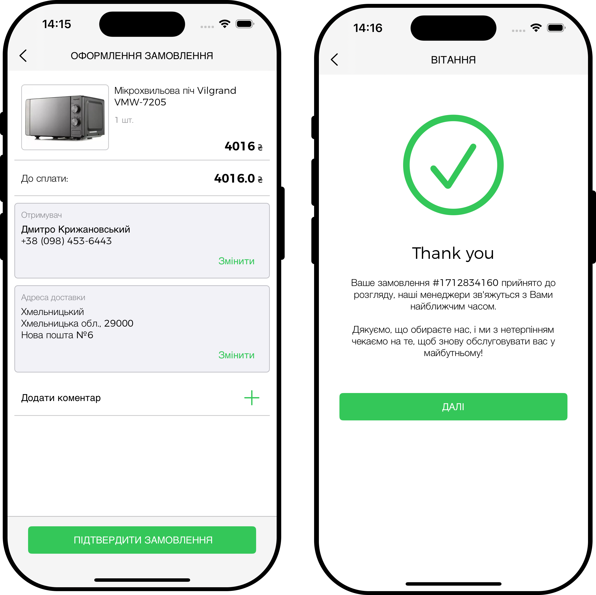

## eShop — мобільний застосунок інтернет‑магазину побутових товарів

Сучасний iOS‑застосунок для перегляду каталогу товарів, формування кошика, створення замовлень і залишення відгуків. Бекенд побудований на безсерверній архітектурі AWS з GraphQL API на AppSync.

### Зміст

- **Огляд**
- **Функціональні можливості**
- **Скріншоти інтерфейсу**
- **Архітектура та технології**
- **Модель даних (огляд)**
- **Збирання та запуск (iOS)**
- **Інтеграція AWS (Amplify)**
- **Тестування**
- **Ліцензія та авторство**

### Огляд

Мета — надати користувачам зручний інструмент для онлайн‑покупок побутових товарів. Застосунок реалізовано для iOS (UIKit, Swift), взаємодія з бекендом — через GraphQL/AppSync. Інфраструктура: Cognito, DynamoDB, S3, Lambda, OpenSearch, CloudWatch, Amplify.

### Функціональні можливості

- **Реєстрація/авторизація** (Cognito, email‑верифікація)
- **Каталог і пошук** за фільтрами (OpenSearch)
- **Детальна картка товару** з характеристиками, фото, статусом, ціною
- **Кошик і оформлення замовлення**
- **Відгуки та рейтинги**
- **Список бажаного**
- **Історія замовлень**
- **Статичні сторінки**: Про нас, Доставка, Гарантія

### Скріншоти інтерфейсу

Нижче наведено частину макетів/екранів застосунку (див. папку `Screenshots`).

<table>
  <tr>
    <td></td>
    <td></td>
  </tr>
  <tr>
    <td></td>
    <td></td>
  </tr>
  <tr>
    <td></td>
    <td></td>
  </tr>
  <tr>
    <td></td>
    <td></td>
  </tr>
 </table>

### Архітектура та технології

- **Безсерверна архітектура AWS**
  - **AppSync (GraphQL API)** — єдина точка доступу
  - **Cognito** — ідентифікація, аутентифікація, авторизація
  - **Lambda (.NET/C#)** — бізнес‑логіка
  - **DynamoDB** — NoSQL‑сховище сутностей
  - **S3** — медіаконтент (зображення, документи)
  - **OpenSearch** — індексація та пошук товарів
  - **CloudWatch** — моніторинг і логи
  - **Amplify** — інтеграція сервісів на клієнті, codegen моделей/запитів
- **Клієнт iOS**: Swift + UIKit, архітектура екранів — MVC
- **Аналітика/стабільність**: Firebase Analytics/Crashlytics

#### Фрагмент GraphQL‑схеми (тип Product)

```graphql
type Product @aws_iam @aws_cognito_user_pools {
  id: ID!
  brandId: ID!
  brand: Brand!
  categoryId: ID!
  ean: String!
  name: String!
  siteUrl: AWSURL
  imageUrl: AWSURL
  items: [ProductItem!]
  createdAt: AWSDateTime!
  updatedAt: AWSDateTime!
}
```

### Модель даних (огляд)

- **Каталог**: `Category`, `Brand`, `Product`, `ProductItem`, `ProductDetail`, `ProductAttribute`, `Attribute`
- **Ціни/знижки**: `Discount`, `DiscountItem`
- **Запаси**: `Inventory`
- **Кошик/замовлення**: `Cart`, `CartItem`, `Order`, `OrderItem`
- **Адреса/одержувач**: `Address`, `Recipient`
- **Відгуки/рейтинги**: `Review`, `Rating`
- **Список бажаного**: `Wishlist`

### Збирання та запуск (iOS)

Вимоги:

- macOS, Xcode 15+
- iOS 15.0+ (симулятор або реальний пристрій)
- CocoaPods

Кроки:

1. Встановіть залежності (Pods) і відкрийте воркспейс у Xcode
2. Запустіть на симуляторі/пристрої

При необхідності додайте файли конфігурації (Firebase, Amplify) до відповідних каталогів проєкту.

### Інтеграція AWS (Amplify)

Базова послідовність команд:

```bash
amplify init
amplify import auth
amplify import storage
amplify codegen add --apiId <APPSYNC_API_ID>
amplify push
```

У результаті буде згенеровано `awsconfiguration.json` і клієнтські GraphQL‑моделі/запити.

### Тестування

- **Lambda (.NET/C#)** — модульні тести бізнес‑логіки
- **iOS** — Unit/Integration/UI‑тести (XCTest), тестові JSON‑відповіді
- **Хмарні сервіси** — ручні перевірки через консолі AppSync/OpenSearch та моніторинг у CloudWatch
